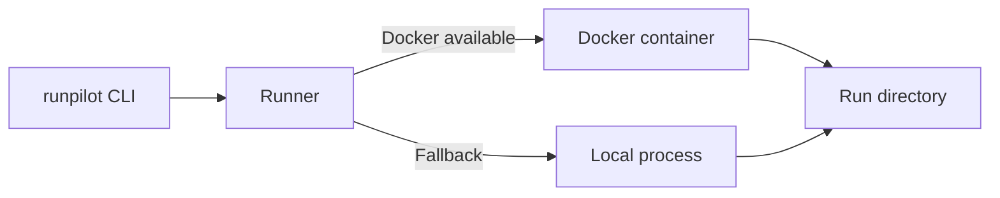

# RunPilot

RunPilot is a lightweight orchestration tool for **reproducible AI and ML training runs**.

You define a training run in a simple config file. RunPilot takes care of:

- Creating a unique run directory
- Capturing metadata and parameters
- Storing logs
- Tracking run history locally

The long term vision is an **open core** CLI with a hosted **RunPilot Cloud** for teams, remote compute and enterprise features.

### Status:
**Version**: `v0.1.0` \
**Stability**: Early alpha - suitable for local experimentation and small projects.

Current capabilities:

- `run` - run a training job with a simple command
- `list` - view history of past runs
- `show` - see details of a specific run
- Per run directories under `~/.runpilot/runs`
- Metadata stored as `run.json`
- Logs stored as `logs.txt`
- Docker based runner when available, with graceful fallback to local execution
- Basic metrics extraction design implemented and tested
- Unit tests passing

This version is focused on **local reproducibility** and a clear foundation for future features.


## Why RunPilot

Most ML workflows end up as a pile of scripts, bash history and half remembered experiments.

RunPilot aims to provide:

- A simple, consistent way to record what you ran and with which parameters
- A local history of runs you can trust
- A future path to remote compute and team workflows without throwing everything away

It is intentionally minimal at v0.1.0 so that the core model of runs and metadata is clean and stable.

## Vision
RunPilot should become the easiest way to:

- Define a training run in a single config file
- Run that job locally in a container with reproducibility by default
- Capture logs and metrics automatically
- Keep a searchable history of runs for comparison and auditing
- Seamlessly scale the same workflow to cloud or cluster execution

In short: `Docker Compose` for machine learning training experiments.

## v0.1 Features (current)

This initial milestone includes:

- `runpilot run <config.yaml>`
- `runpilot list` (show run history)
- `runpilot show <run_id>` (view one run)
- YAML-based config validation
- Per-run directory under: `~/.runpilot/runs/<run_id>/`
- `run.json` metadata: timestamps, exit code, status, image, entrypoint
- `logs.txt` capturing all stdout/stderr
- Docker-based execution if available, fallback if not
- Tests for config, metadata, runner, metrics parsing (WIP)

Upcoming soon:
- Metrics extraction into metrics.json
- Improved CLI formatting / filters
- Optional SQLite backend (planned, not implemented)

## Quickstart (dev)

> Requirements: Python 3.10 or newer, `git`. Docker is optional but recommended.

### 1. Clone the repo

```bash
git clone git@github.com:SamVain/RunPilot.git
cd RunPilot
```

### 2. Create a virtual environment
```bash
python3 -m venv .venv
source .venv/bin/activate # On Windows use: .venv\Scripts\activate
```

### 3. Install RunPilot in editable mode
```bash
python -m pip install --upgrade pip
python -m pip install -e .
```

### 4. Confirm the CLI is available
```
runpilot --help
```
You should see the list of available commands such as `run`, `list`, `show`.


### 5. Create a simple example config
```yaml
# example.yaml
name: hello-run
image: "python:3.11-slim"
entrypoint: "python -c 'print("hello from RunPilot stub")'"
```

The exact schema may differ depending on how you wire your entrypoint. The important part is that the config is:

- Human readable
- Saved with your code
- Passed consistently into RunPilot

### 6. Run a training job
```bash
runpilot run runpilot.yaml
```
RunPilot will:

- Create a new run directory under `~/.runpilot/runs/<run-id>`
- Write `run.json` (metadata, parameters, timestamps, status)
- Stream logs into `logs.txt`
- Attempt to use Docker if configured, otherwise fall back to local execution

### 7. List previous runs
```bash
runpilot list
```
Example Output:
```text
ID        Name                 Status    Started                 Duration
rp_0001   mnist-cnn-baseline   success   2025-11-14T19:32:10Z    00:02:31
rp_0002   mnist-cnn-lr-1e-4    running   2025-11-14T20:05:01Z    -
```

### 8. Inspect a specific run
```bash
runpilot show rp_0001
```
This prints key metadata such as:

- Run id
- Name
- Parameters
- Start and end time
- Status
- Paths to logs and outputs
- Any recorded metrics (if configured)

### Run Layout:
By default RunPilot stores all runs under:  
`~/.runpilot/runs/`

Each run gets its own directory, for example:
```text
~/.runpilot/runs/
  rp_0001/
    run.json
    logs.txt
    outputs/
      model.pt
      metrics.json
  rp_0002/
    run.json
    logs.txt
```

### Core files:
1. `run.json`
   -  Contains metadata such as:
      -  Run ID
      -  Name
      -  Parameters
      -  Status
      -  Timestamps
      -  Runner information (Docker/local)
      -  Optional metrics summary

2. `logs.txt`
    -  Combined logs from the job. Can be tailed during or after the run.

3. `outputs/`
    -  Optional directory for artifacts generated by the run, for example model weights or metrics.

This filesystem based layout is deliberately simple in v0.1.0 so that:
- You can inspect runs with plain tools
- It is easy to back up or sync
- Future RunPilot Cloud can attach to the same model without breaking changes

## How RunPilot Executes Jobs
At a high level:



- The CLI parses your config
- A run id is allocated and the run directory is created
- The runner chooses Docker when possible
- Logs and metadata are written continuously into the run directory


## CLI Reference (v0.1.0)

`runpilot run` — Run a new training job.

```bash
runpilot run <config-path> [options]
```
Typical options might include:

- `--name`
- `--tag`
- `--no-docker` or `--force-local`

Check `runpilot run --help` for the exact flags.

### 
`runpilot list` — List previous runs.

```bash
runpilot list
```
Planned improvements:

- Filtering by status, tag or date
- Limiting the number of results
- Machine readable output such as JSON

###
`runpilot show` — Show metadata for a single run.

```bash
runpilot show <run-id>
```
Useful for:

- Debugging failed runs
- Inspecting parameters and metrics
- Locating logs and outputs


## Roadmap
This is an early version. The plan is roughly:

v0.1.x - Local foundation
- Stable CLI for run, list, show
- Clear run metadata schema
- Basic metrics extraction and display
- Solid tests and documentation

v0.2.x - Power tools for individuals
- `runpilot metrics` command
- Export and import runs (tar or zip)
- Config file at repo root
- Nicer CLI output and error messages

v0.3.x - Cloud ready core
- Stable run schema suitable for syncing with a service
- Optional remote metadata storage
- Hooks for authentication and remote runners

RunPilot Cloud  
Future paid offering is planned to include:

- Hosted control plane and web UI
- Remote compute orchestration
- Team and project level history and dashboards
- Single sign on and RBAC
- Audit logs for regulated environments

Cloud work will be built on top of the same run model you are using locally.

## Example (future)

This is the kind of experience v0.1 and beyond will aim for:

```bash
runpilot run config.yaml
```

With a config like:

```yaml
name: "mnist-cnn-baseline"
entrypoint: "python train.py"
params:
  learning_rate: 0.001
  batch_size: 64
  epochs: 10
tags:
  - "mnist"
  - "cnn"
  - "baseline"
```

## Project Status
RunPilot is currently in the early foundation stage.
The goals are to:

- Deliver a stable local runner
- Support metrics logging and search
- Refine the CLI and UX
- Prepare for future cloud execution model

## Contributing
RunPilot is currently under active early development.

If you want to contribute:

1. Fork the repository
2. Create a feature branch
3. Run tests locally
4. Open a pull request

Early feedback, issues and suggestions are very welcome. The goal is to grow RunPilot into a reliable, boring core tool for ML practitioners that just want their experiments tracked properly.

## License
Apache 2.0 (pending final confirmation)
